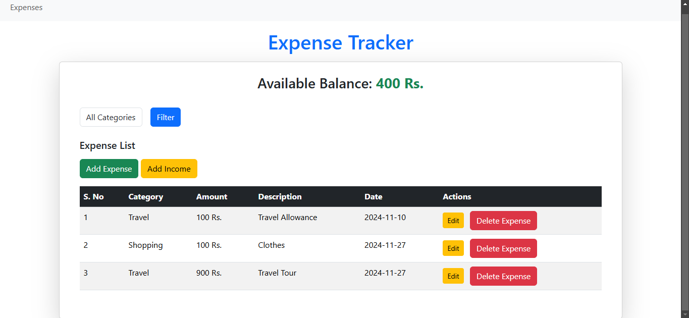

# Laravel Expense Tracker

Laravel Expense Tracker is a simple, secure, and user-friendly application for managing your daily expenses. Built with Laravel, it allows you to add, edit, delete, and categorize expenses with ease. Encrypted URLs ensure secure operations, while responsive design provides seamless usability across devices.

## Features

-   Add, edit, and delete expenses.
-   Categorize expenses (e.g., Food, Travel, Shopping).
-   Secure URL encryption for sensitive operations.
-   Responsive design for mobile and desktop compatibility.
-   Robust data validation for user inputs.

## Technologies Used

-   **Backend**: Laravel 11
-   **Frontend**: Bootstrap 5, HTML, CSS
-   **Database**: MySQL
-   **Server Requirements**:
    -   PHP 8.0 or higher
    -   Composer
    -   MySQL 5.7+ or MariaDB 10+

## Screenshots

### Homepage



### Add Expense Form


### Edit Expense


## Installation

Follow these steps to set up the project on your local machine:

### Prerequisites

-   PHP 8.0 or higher installed on your machine.
-   Composer installed for dependency management.
-   MySQL database ready for connection.

### Steps

1. **Clone the repository**:

    ```bash
    git clone https://github.com/Rajgohel0312/laravel-expense-tracker.git
    cd laravel-expense-tracker
    ```

2. **Configure environment variables**:

    - Duplicate the `.env.example` file and rename it to `.env`.
    - Update the following lines in the `.env` file:
        ```dotenv
        DB_CONNECTION=mysql
        DB_HOST=127.0.0.1
        DB_PORT=3306
        DB_DATABASE=your_database_name
        DB_USERNAME=your_username
        DB_PASSWORD=your_password
        ```

3. **Run migrations**:

    ```bash
    php artisan migrate
    ```

4. **Run the server**:

    ```bash
    php artisan serve
    ```

5. Open the application in your browser:
    ```
    http://127.0.0.1:8000
    ```

## Usage

1. Navigate to the app's homepage to view all expenses.
2. Add new expenses using the "Add Expense" form.
3. Edit or delete expenses using the provided buttons, with operations secured by encrypted URLs.

## Security

-   Encrypted IDs in URLs to prevent direct access to records.
-   Validation rules to ensure data integrity.

## Contact

For any queries or suggestions, please contact:

-   **Name**: Gohel Raj
-   **Email**: rajgohel2016@gmail.com
-   **GitHub**: @Rajgohel0312

---

**Happy Tracking! 🎉**
